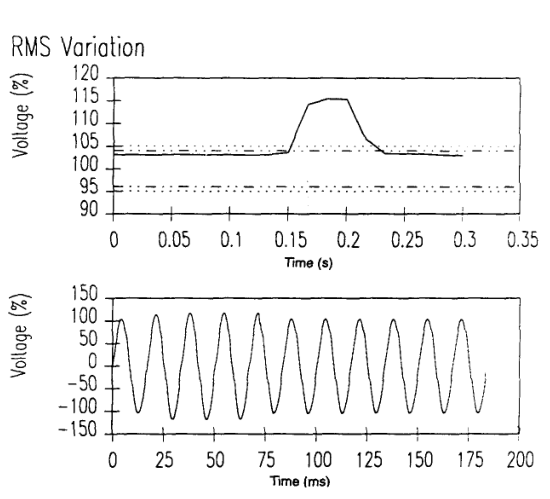
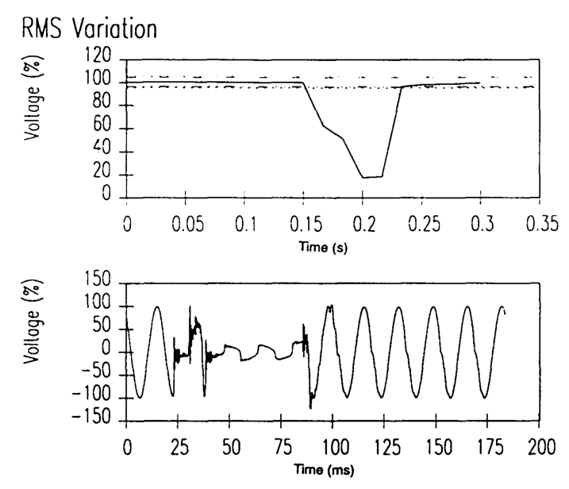
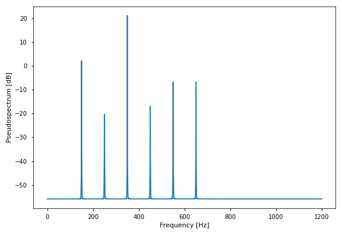

\newpage

# Qualità dei Sistemi Elettrici di Potenza

Negli anni il numero di studi operati nell'area riguardante la qualità nei
sistemi elettrici di potenza è aumentato notevolmente [@dsp-pqd].
Questo è dovuto principalmente all'impiego di nuove fonti di energia, diverse
esigenze del consumatore e alla liberalizzazione del settore energetico.

L'avvento di nuove fonti di energia rinnovabile, come impianti solari ed eolici,
porta con se alcune criticità dovute ai disturbi che queste generano quando
allacciate alla rete elettrica.
L'interconnessione alla rete elettrica di fonti di energia caratterizzate da
una capacità produttiva variabile nel tempo è infatti causa di disturbi come
il *voltage swell* e il *voltage dip* [@effective-power-quality]. 

{#fig:swell width=60%}

Lo standard *IEEE 1159* definisce questi due disturbi [@ieee-1159].
Il *voltage swell* è un aumento del valore efficace della tensione.
Questo evento può durare da un tempo pari alla metà del periodo dell'armonica
principale, fino ad 1 minuto.
In [@fig:swell] si può osservare l'effetto di questo disturbo in una
linea monofase.

{#fig:dip width=60%}

Il *voltage dip* è invece un calo di tensione compreso tra il 10% e il 90% del
valore efficace.
La durata, analogamente al *voltage swell* è compresa tra metà periodo e 1
minuto.
L'effetto in una linea monofase, dovuto ad un cortocircuito, si può osservare
in [@fig:dip].

L'utilizzo di inverters al fine di convertire la corrente continua
generata dai pannelli solari e dalle turbine eoliche in corrente alternata,
causa l'inserimento di armoniche e inter-armoniche nella rete, dovute alla
natura non lineare di questi dispositivi [@impact-inverters].

Un'altra fonte di disturbi armonici e inter-armonici sono i dispositivi non
lineari, necessari al funzionamento dei dispositivi alimentati in corrente
continua in uso al giorno d'oggi.
In ambito civile infatti, a differenza dei contesti industriali, buona
parte del fabbisogno energetico domestico è speso in illuminazione,
riscaldamento, aria condizionata e dispositivi elettronici, come personal
computers e televisori [@losses-cables].
Nell'ultimo secolo si è quindi osservato un forte peggioramento della qualità
della rete, provocato da un uso sempre maggiore di inverters, raddrizzatori di
tensione e motori elettrici.

Una distorsione armonica è la presenza nel segnale di componenti armoniche
con frequenze multiple della frequenza di rete $f_0$, mentre una distorsione
inter-armonica è caratterizzata da frequenze che deviano da quelle armoniche.
Le problematiche dovute a questi tipi di disturbo sono molteplici.

Una ricerca svolta dall'*Institute of Electrical and Electronics Engineers*
ha studiato gli effetti delle armoniche ad alta frequenza sul funzionamento
dei trasformatori monofase. È stata individuata una proporzionalità
tra le dissipazioni dovute a correnti parassite e il quadrato della frequenza
dell'armonica considerata [@transformer-harmonic-loss].
Questo significa che un buon algoritmo di stima delle armoniche deve essere
in grado di individuare anche alte frequenze.
Lo stesso Istituto ha svolto un ulteriore studio, il quale dimostra che le
perdite di carico nei cavi e nei trasformatori di un impianto elettrico, dovute
ad un'elevata presenza di armoniche, possono essere sufficientemente alte da
giustificare modifiche all'impianto, come l'aumento della sezione dei cavi
o l'installazione di condensatori per il rifasamento [@losses-cables].

Al fine di caratterizzare l'entità dei disturbi armonici e inter-armonici
all'interno di un segnale elettrico di potenza, risulta utile l'utilizzo
della **Distorsione Armonica Totale**.
$$
THD^2 = \frac{\sum_{k=2}^{K} V_k^2}{V_1^2}
$$
Dove $V_1$ è la tensione di linea e $V_k$ è la tensione della $k$-esima
armonica. Il THD è quindi la percentuale di energia presente nel segnale non
dovuta alla componente fondamentale [@dsp-pqd].

La liberalizzazione del mercato dell'energia ha delle notevoli conseguenze
nel campo della qualità dei segnali di potenza [@power-quality-deregulation].
La necessità di aumentare i margini di guadagno porta le compagnie operanti
nel settore dell'energia a ridurre la manutenzione e lo sviluppo dei
sistemi di distribuzione.
Ciò comporta un inevitabile peggioramento della qualità.
Inoltre, la ridotta cooperazione tra società in concorrenza tra loro impatta
negativamente lo sviluppo di tecnologie e standards.

# Algoritmi per la stima dei disturbi armonici

Esistono numerosi algoritmi che permettono di stimare frequenza, ampiezza e
fase delle componenti sinusoidali di un segnale.
Si noti che non esiste un algoritmo adatto ad ogni contesto.
Spesso infatti, la precisione sulle misurazioni è correlata alla complessità
computazionale.

Il primo metodo basato sullo studio della matrice di covarianza delle
osservazioni è la *Pisarenko Harmonic Decomposition* (PHD)
[@pisarenko-single-tone], risalente al 1973 [@pisarenko-original].
La PHD, basandosi sull'autovalore minore della matrice di covarianza, e
all'autovettore associato [@pisarenko-stat-analysis], permette di stimare le
frequenza di una sinusoide addizionata a rumore bianco gaussiano:
$$
\hat{\omega} = cos^{-1} \left(
    \frac{r_2 + \sqrt{r_2^2 + 8 r_1^2}}{4 r_1}
\right)
$$
dove $r_k$ è la covarianza campionaria:
$$
r_k = \frac{1}{N - k} \sum_{n=1}^{N-k} x(n) x(n + k)
$$
Questo algoritmo permette la stima solamente dell'armonica principale e non è
quindi utile nello studio dei disturbi armonici.

L'algoritmo più usato è la *Fast Fourier Transform* (FFT) che permette
di calcolare la *Discrete Fourier Transform* (DFT) ([@eq:dft]) di un segnale
a tempo discreto di lunghezza finita $N$.
$$
X[k] = \sum_{n=0}^{N-1} x[n] \, e^{-j \frac{2\pi}{N}kn}
$$ {#eq:dft}
È un algoritmo di tipo *Divide and Conquer* ed ha quindi una complessità
asintotica $\mathcal{O}(N\log{}N)$ [@fourier-alg-machine].
È un algoritmo veloce e di facile implementazione, ma ha molte limitazioni.

La risoluzione dello spettro generato è inversamente proporzionale alla
lunghezza del segnale campionato
$$
\Delta f = \frac{1}{t_w}
$$
dove $t_w$ è la durata temporale del campionamento [@alg-comp-quality].
Se il segnale contiene armoniche la cui frequenza cambia nel tempo, $t_w$
deve essere sufficientemente piccolo da permettere una risoluzione temporale
che consenta di osservare la variazione delle frequenze.
Questo però implica una bassa risoluzione spettrale, la quale implica un
notevole errore sulla stima della frequenza.

La FFT soffre inoltre dell'effetto di *spectral leakage*
[@fft-time-domain-window].
Se la lunghezza del segnale non è tale da includere esclusivamente periodi
interi di ogni componente sinusoidale, lo spettro presenta errori di frequenza,
ampiezza e fase.
Poiché non è possibile conoscere a priori la lunghezza necessaria per non
ottenere questo effetto, ogni applicazione reale della FFT presenterà errori
di misura dovuti al *leakage*.

L'*Interpolated Fast Fourier Transform* (IFFT) è un algoritmo sviluppato al
al fine di ottenere misurazioni precise di frequenza, ampiezza e fase da
segnali affetti da *spectral leakage* [@ifft-comp].
L'algoritmo è basato sull'applicazione al segnale di una funzione finestra
opportunamente scelta [@ifft-original].
Due funzioni finestra spesso utilizzate sono la *Hanning window*
([@eq:hanning-window]) e la *Rife-Vincent window*.
$$
w[n] = sin^2 \left( \frac{\pi n}{N} \right)
$$ {#eq:hanning-window}
Uno studio pubblicato dalla IEEE [@ifft-comp] ha
confrontato le prestazioni di queste due funzioni finestra.
La *Hanning window* è risultata la scelta più adeguata per segnali con
un basso rapporto segnale/rumore (SNR) e dei quali non si hanno informazioni
sulle frequenze contenute.

{#fig:music-odd-even width=60%}

*Multiple Signal Classification* (MUSIC) è un algoritmo basato sull'analisi
della matrice di autocorrelazione, in particolare sulla sua decomposizione
in autovettori [@multiple-emitter-location].
MUSIC prevede di ricavare uno pseudo-spettro ([@fig:music-odd-even]) stimando
il sottospazio del rumore, e di ottenere le informazioni sulle frequenze dai
massimi locali.
Al fine di stimare la matrice di correlazione $R$, una matrice $\mathbf{V}$
viene costruita mediante scorrimento di una finestra larga $M$ sul segnale
campionato di lunghezza $N$.
$$
R = \frac{1}{N} \mathbf{V}^t \, \mathbf{V}
$$

Il metodo ESPRIT, a differenza di MUSIC, sfrutta il sottospazio del rumore
[@dsp-pqd].
L'algoritmo permette di individuare [@esprit-original] la matrice diagonale
di rotazione $\Phi$, i cui elementi sono gli esponenziali complessi le cui
fasi sono le pulsazioni delle $K$ componenti sinusoidali del segnale.
$$
\Phi = diag \left\{ e^{j \omega_1}, \, \ldots, \, e^{j \omega_K} \right\}
$$
Una matrice $\Psi$, i cui autovettori coincidono con gli elementi sulla
diagonale di $\Phi$, viene stimata grazie alla decomposizione ai valori
singolari (SVD) della matrice $\mathbf{V}$ usata in MUSIC.
ESPRIT permette anche la stima del decadimento (se presente) delle sinusoidi
modellando opportunamente i gli esponenziali complessi:
$$
\Phi = diag \left\{
    e^{-\beta_1 + j \omega_1}, \, \ldots, \, e^{- \beta_K + j \omega_K}
\right\}
$$
dove $\beta_k$ è il decadimento della $k$-esima armonica.

Una possibile rappresentazione matematica del segnale è quella in spazio di
stato. Nel caso di un segnale stazionario, questo può essere rappresentato da
due equazioni [@dsp-pqd]:
$$
\begin{cases}
\mathbf{x}[n] = A \, \mathbf{x}[n-1] + \mathbf{w}[n] \\
\mathbf{z}[n] = C \, \mathbf{x}[n] + \mathbf{v}[n]
\end{cases}
$$
dove $\mathbf{x}$ è il vettore di stato, $A$ la matrice di transizione,
$\mathbf{w}$ il vettore del rumore, $\mathbf{z}$ il vettore delle misurazioni,
$C$ la matrice di misurazione e $\mathbf{v}$ il vettore del rumore dovuto alla
misurazione.

Sfruttando questa rappresentazione è possibile stimare il contenuto armonico
(e altri tipi di disturbi) applicando il filtro di Kalman.
L'algoritmo si basa sulla minimizzazione dell'errore $\mathbf{e}$ nella stima
del vettore di stato $\mathbf{x}$ [@state-est-kalman].
$$
\mathbf{e}[n] = \mathbf{x}[n] - \hat{\mathbf{x}}[n]
$$

<!--
Algoritmi:
  - FFT
    - Più usata
    - Veloce
    - Problema: leakage
  - IFFT
    - corregge il leakage
  - Kalman
-->

<!--
- Cause
    - Arc furnace
- Conseguenze
- Soluzioni
- Normative
-->

# Stima di Armoniche e Interarmoniche

## Modello Sinusoidale
Ogni segnale a tempo discreto $v[n]$ ottenuto da una rete elettrica può essere espresso come la sovrapposizione di $K$ componenti sinusoidali, più una componente di rumore.
$$
v[n] = s[n] + w[n] = \sum_{k=1}^K s_k[n] + w[n]
$$
Le componenti sinusoidali sono caratterizzate dall'ampiezza $a_k \geq 0$, dalla fase $\phi_k \in [-\pi, \pi]$ e dalla pulsazione $\omega_k$.
$$
s_k[n] = a_k \, cos \left( n \omega_k + \phi_k \right)
$$
Le componenti $s_k[n]$ sono chiamate **armoniche** quando la loro pulsazione è un multiplo della pulsazione fondamentale $\omega_0$, altrimenti sono dette **interarmoniche**.

La $\tilde{k}$-esima armonica ha pulsazione $\omega_k = 2 \tilde{k} \pi f_0$.
Si noti che le frequenze sono normalizzate rispetto alla frequenza di campionamento secondo la relazione $f_k = \tilde{f_k} / f_s$, dove $\tilde{f_k}$ è la frequenza in $\si{\hertz}$ e $f_s$ è la frequenza di campionamento.
Pertanto, se viene rispettato il Teorema del Campionamento di Nyquist-Shannon:
$$
f_c > 2 \, max\{f_k\}
$$
ne deriva che $\omega_k \in \left[ -\pi, \pi \right]$.

La $0$-esima armonica, avendo pulsazione nulla, è detta componente di corrente continua e il suo valore di tensione è $V_{DC} = a_0 \, cos(\phi_0)$.
L'armonica fondamentale è detta invece componente di potenza ed ha pulsazione $\omega_0 = \tau \tilde{f}_0 / f_c$ e ampiezza $a_0 = \sqrt{2} \, V_{rms}$, dove $\tilde{f}_0$ è la frequenza della rete e $V_{rms}$ è la tensione efficace di fase.

## Modello Armonico
Il segnale $v[n]$ può essere espresso anche sotto forma di esponenziali complessi. La $k$-esima componente ha quindi la seguente forma:
$$
v_k[n] = A_k e^{j \phi_k} e^{j n \omega_k}
$$

Due campioni successivi della componente $v_k[n]$ sono legati da uno sfasamento pari alla sua pulsazione $\omega_k$.
$$
v_k[n+1] = v_k[n] e^{j \omega_k}
         = A_k e^{j \phi_k} e^{j (n+1) \omega_k}
$$

## Riduzione Dimensionale del Segnale
Dato un segnale $v[n]$ di lunghezza $L = N + M - 1$, si definisce il vettore dei campionamenti $\mathbf{v}[n]$ come la finestra di ampiezza $M$ da $v[n]$ a $v[n + M - 1]$.
Il vettore $\mathbf{v}[n]$ è quindi un campionamento $M$-dimensionale del segnale.

Si costruisce [@dsp-pqd] la matrice $\mathbf{V}$, di dimensioni $N \times M$, ponendo sulle righe i vettori di campionamento $\mathbf{v}[n]$
$$
\mathbf{V} =
\begin{bmatrix}
    \mathbf{v}^t[0] \\
    \vdots \\
    \mathbf{v}^t[N - 1]
\end{bmatrix}
=
\begin{bmatrix}
v[0]   & \dots  & v[M - 1] \\
\vdots & \ddots & \vdots   \\
v[N - 1] & \dots & v[N + M - 2]
\end{bmatrix}
$$
ottenendo quindi una sequenza di $N$ misurazioni $M$-dimensionali.

Assumendo che il rumore $w[n]$, e di conseguenza il segnale $v[n]$, abbia media nulla, si osserva che migliore è la scelta di $M$, tale che ogni vettore di campionamento $\mathbf{v}[n]$ includa periodi interi di ogni armonica, più la media di $\mathbf{v}[n]$ tende ad annullarsi.

Ciò permette di stimare la matrice di correlazione campionaria $\mathbf{R}_{kl}$
$$
\hat{\mathbf{R}}_{kl} = \mathit{E} \left\{
    \mathbf{v}^{(k)} \circ \mathbf{v}^{(l)}
\right\}
  = \frac{1}{N} \, \mathbf{v}^{(k)} \cdot \mathbf{v}^{(l)}
$$
, dove $\mathbf{v}^{(k)}$ è la $k$-esima colonna di $\mathbf{V}$.
Riscrivendo l'equazione in forma matriciale si ottiene:
$$
\hat{\mathbf{R}} = \frac{1}{N} \, \mathbf{V}^t \, \mathbf{V}
$$

## Algoritmo MUSIC
Per il principio della sovrapposizione degli effetti la matrice di correlazione del segnale $\mathbf{R}$ può essere espressa come somma della matrici di correlazione $\mathbf{R}_s$ e $\mathbf{R}_n$ dovute rispettivamente alle componenti armoniche e al rumore.

Assumendo che il rumore sia di natura gaussiana con varianza $\sigma_w^2$, la sua matrice di correlazione vale:
$$
\mathbf{R}_w = \sigma_w^2 I
$$
dove $I$ è la matrice identità di dimensione $M \times M$ e $\sigma_w^2$ coincide con la potenza del rumore.

## Algoritmo ESPRIT

Isolando le componenti di segnale e di rumore, utilizzando una notazione analoga a quella del vettore dei campionamenti, si ha:
$$
\mathbf{v}[n] = \sum_{k=1}^K \mathbf{s}_k[n] + \mathbf{w}[n]
$$ {#eq:sig:sampleform}
Studiando il contributo $\mathbf{s}_k[n]$ della $k$-esima componente armonica e applicando le proprietà del modello armonico, è possibile esprimere ogni elemento $\mathbf{s}_{k,i}[n]$ in funzione di $s_k[n]$:
$$
\mathbf{s}_{k,i}[n] = s_k[n + i] = s_k[n] e^{j i \omega_k}
$$
E riscrivendo $\mathbf{s}_k[n]$ in forma vettoriale si ottiene:
$$
\mathbf{s}_{k}[n] = s_k[n]
\begin{bmatrix}
    1 \\
    e^{j \omega_k} \\
    \vdots \\
    e^{j (M-1) \omega_k}
\end{bmatrix} =
s_k[n] \, \mathbf{e}_k
$$
dove $\mathbf{e}_k$ è detto *vettore steering*, il quale è formato dagli sfasamenti successivi associati alla pulsazione $\omega_k$.

È quindi possibile riscrivere l'equazione {@eq:sig:sampleform} come trasformazione lineare del vettore delle ampiezze complesse $\mathbf{A}$:
$$
\mathbf{v}[n] = \mathbf{E} \Phi^n \mathbf{A} + \mathbf{w}[n]
$$
dove $\mathbf{E}$ è una matrice $M \times K$ le cui $k$-esima colonna è il vettore steering associato alla pulsazione $\omega_k$
$$
\mathbf{E} = \left[ \mathbf{e}_1, \ldots, \mathbf{e}_K \right]
$$
, $\Phi$ è una matrice diagonale i cui elementi sono gli esponenziali complessi associati alle $K$ diverse pulsazioni
$$
\Phi = diag \left\{ e^{j \omega_1}, \ldots, e^{j \omega_K} \right\}
$$
mentre $A$ è il vettore delle ampiezze complesse
$$
\mathbf{A} = \begin{bmatrix}
    A_1 e^{j \phi_1} \\
    \vdots \\
    A_K e^{j \phi_K}
\end{bmatrix}
$$

\newpage
# Riferimenti

